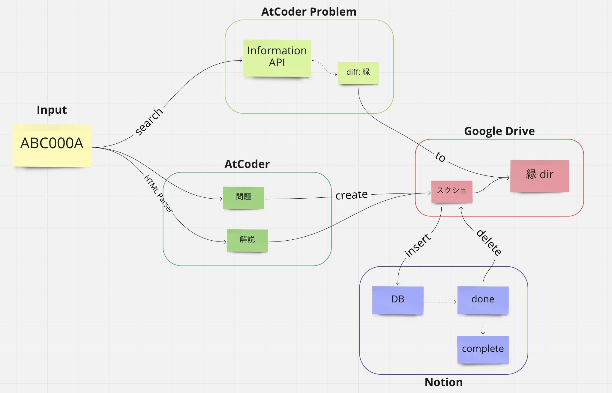
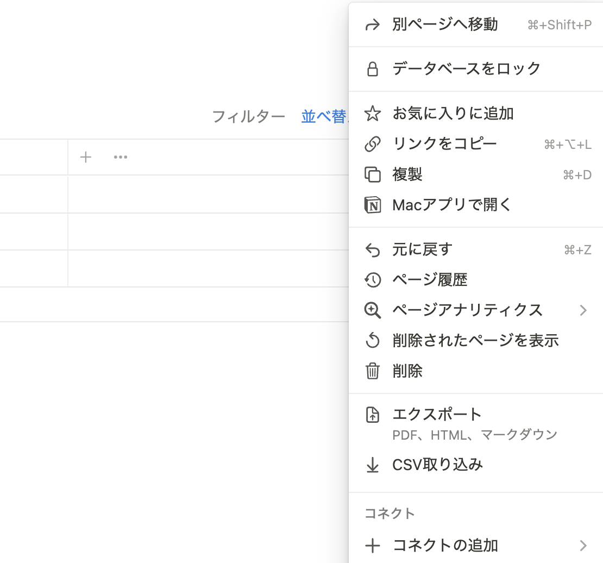
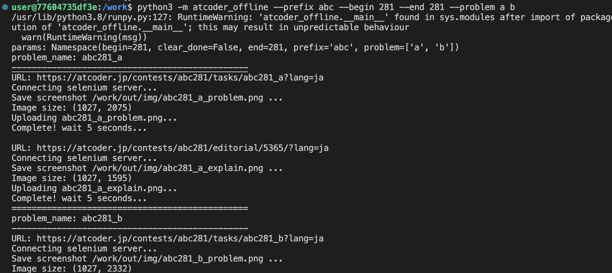
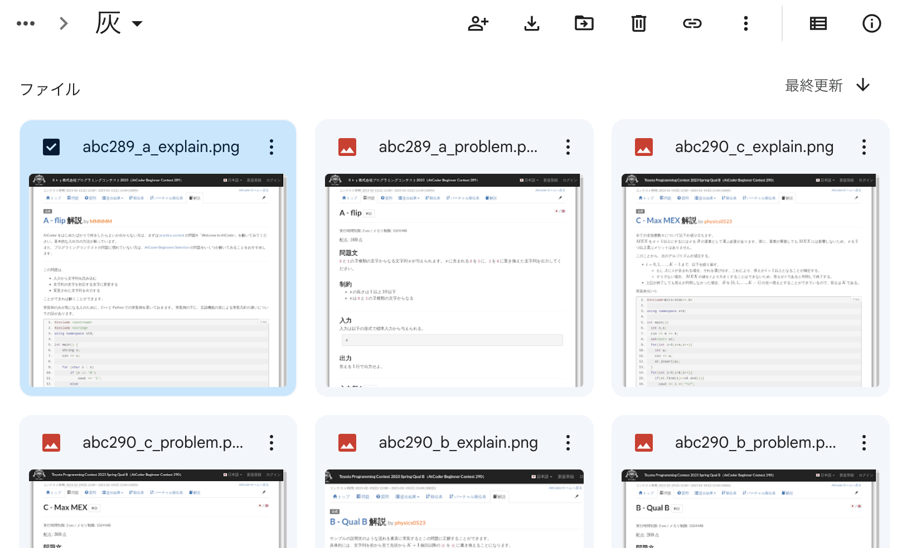

# AtCoder Offline
**概要**
- オフラインでAtCoderの問題・解説ページを見れる環境を作る

**何をするか**

- 指定したコンテストの問題・解説ページのスクリーンショットを撮影し，Googleドライブに保存する

- [AtCoder Problem](https://kenkoooo.com/atcoder/#/table/)の[Information API](https://kenkoooo.com/atcoder/resources/problem-models.json)から各問題のDifficultyを取得し，Difficultyごとに保存

- Notionのデータベースにノートを用意する



## 各種設定

## .env
- **必ず`.env.example.json`を`.env`にリネームする**
- .envファイルにはAPIトークンを保管するため，絶対にgit管理しない

## docker
- docker-compose内の`selenium`コンテナのイメージを次のように変更する

    - intelチップの場合，`image:selenium/standalone-chromium`
    - M1/M2チップ搭載のmacの場合，`image:seleniarm/standalone-chromium`

## Goodleドライブ APIの有効化
- Google Drive APIを有効にし，PyDrive2からGoogleドライブを操作できるようにする

- 参考 https://qiita.com/ftnext/items/60ced8bc432bec6101f0 

## Goodleドライブの保存先
**フォルダ構成**
- フォルダ名は固定

- 保存先のディレクトリをオフラインで使用可能にしておく


**フォルダIDの取得**
- `env.json`の`COLOR_TO_DIR`に，それぞれの色に対応するフォルダIDを設定する

- フォルダIDは，フォルダを開いてURLを確認することで得られる
```
https://drive.google.com/drive/folders/<フォルダID>
```

## Notion APIの有効化
- https://www.notion.so/my-integrations からインテグレーションを作成し，トークンを取得

- ******************の部分をコピーし，`env.json`の`TOKEN_NOTION`に割り当てる


参考 (公式) https://developers.notion.com/docs/create-a-notion-integration

## Notion データベースの用意
**データベースの作成**
- プロパティに`contest`, `color`, `status`を持つデータベースを作成する


**インテグレーションの接続**
- コネクトの追加から，作成したインテグレーションを追加する



## 結果

**実行結果**



**Googleドライブ**



**Notion**


## 参考
macの場合，ベースイメージをseleniumではなくseleniarmを使う (docker-compose)

https://qiita.com/xy2e45/items/2895fe98e79fe9da3d9c

Seleniumを使ってスクリーンショット

https://tech-lab.sios.jp/archives/28840

Googleドライブの操作

https://note.nkmk.me/python-pydrive-folder/

beautifulsoup

https://senablog.com/python-bs4-search/
https://qiita.com/d_m/items/f477c6665ec69dfaf594
https://pystyle.info/scraping-beautiful-soup-how-to-refer-elements/#outline__11